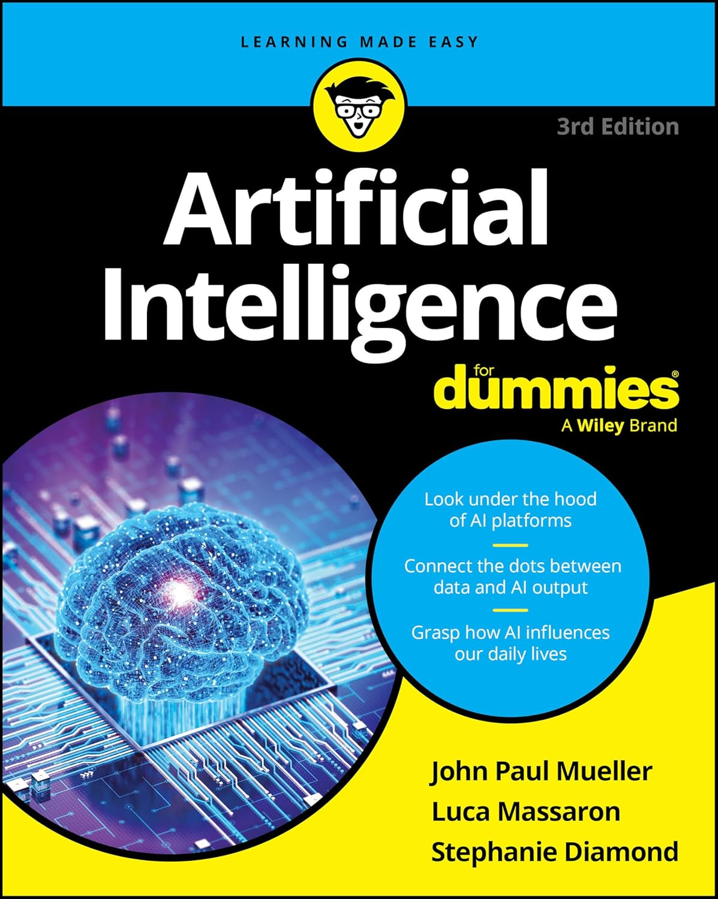
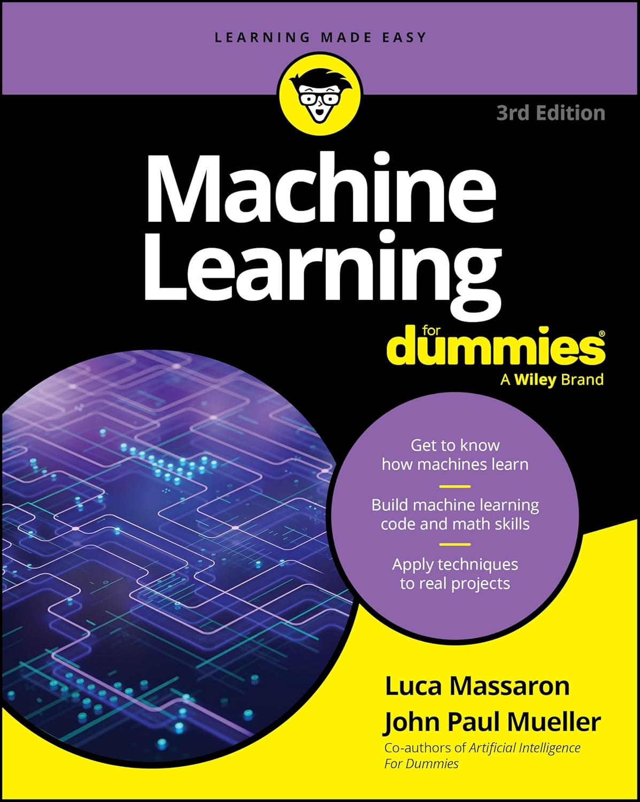
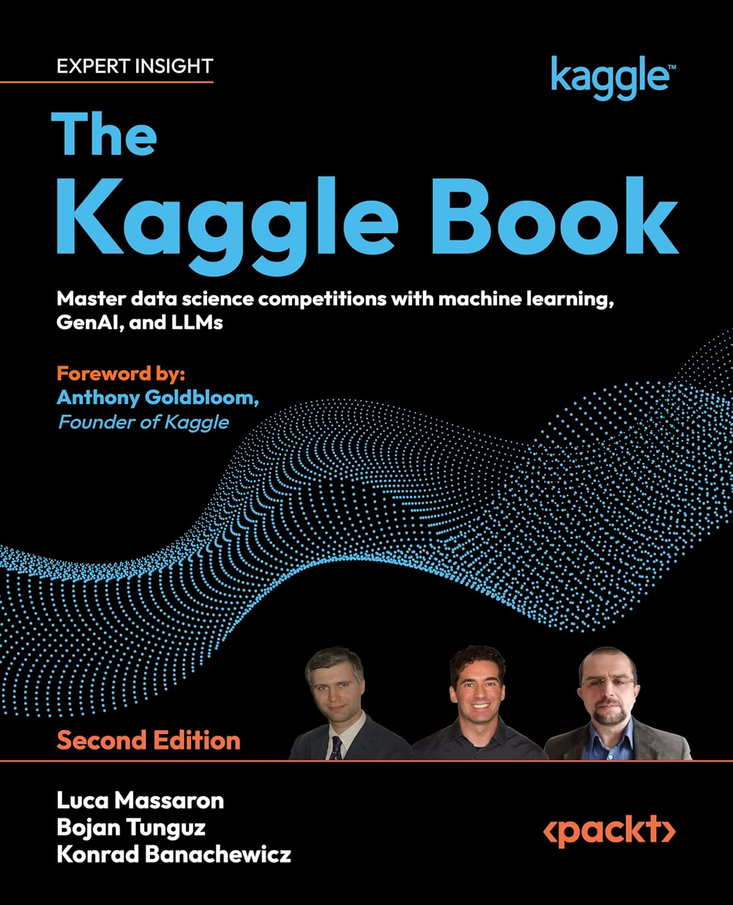
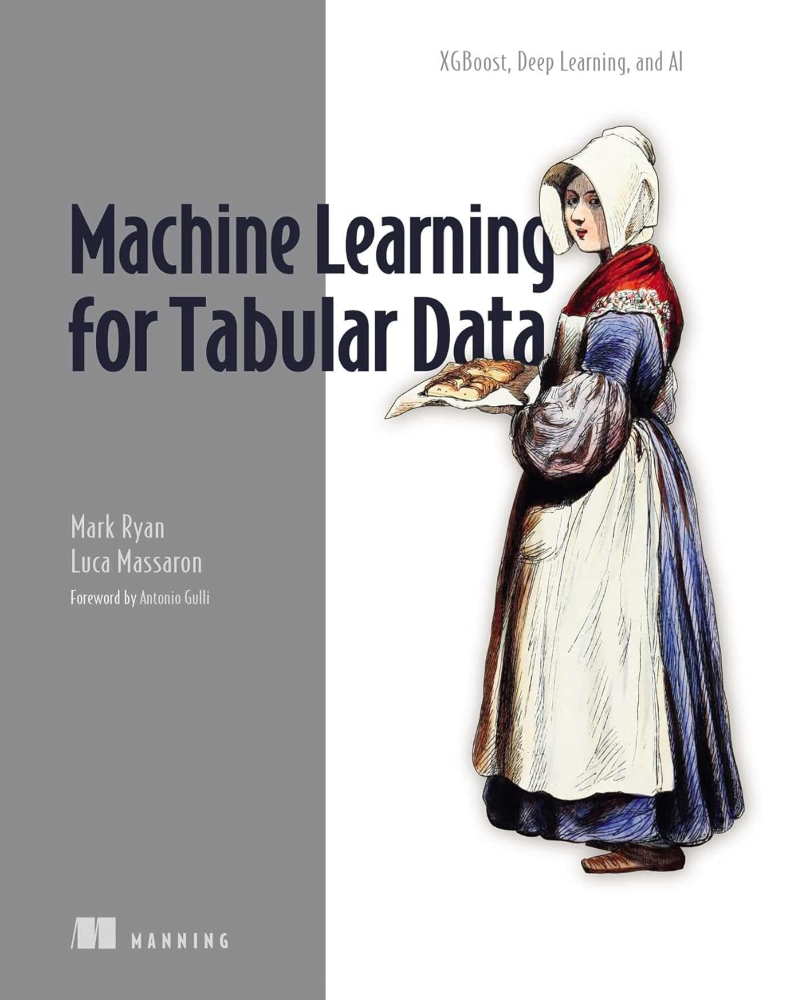

# Hi, I'm Luca

I am a **Senior Data Science Expert** at illimity Bank, a **Google Developer Expert (GDE)**, and a **2x Kaggle Grandmaster** in competitions and notebooks (previously ranked #7 worldwide for competitions). With over 20 years of experience, I specialize in solving complex challenges in banking, finance, and insurance through Machine Learning and AI.

---

### WHAT I'M WORKING ON

*   **Large Language Models (LLMs):** Recently, I've been focused on fine-tuning Google's **Gemma 2 and Gemma 3** models, including techniques like **Generative Reward Post-Optimization (GRPO)**.
*   **Tabular Data & Deep Learning:** Continuing my work on making deep learning more accessible and effective for tabular datasets, often linked to my research and books.
*   **Authoring:** I have authored or co-authored over **15 books** on data science and AI, including the "For Dummies" series for Wiley and a book on tabular machine learning for Manning.
* **Community & Mentorship:** I am a Google Developer Expert (GDE) in AI, Cloud, and Kaggle. I have been a mentor for the **KaggleX BIPOC Mentorship Program** and frequently speak at international conferences and meetups.

---

### BOOKS

I've written extensively to bridge the gap between complex AI concepts and practical application.

  
  &nbsp;&nbsp;&nbsp;&nbsp;
    
  &nbsp;&nbsp;&nbsp;&nbsp;
  
  &nbsp;&nbsp;&nbsp;&nbsp;
  

| Book | Publisher | Focus |
| :--- | :--- | :--- |
| **Artificial Intelligence For Dummies** | Wiley | A comprehensive guide to AI for all levels. |
| **Machine Learning For Dummies** | Wiley | An introduction to core concepts and algorithms. |
| **The Kaggle Book** | Packt | A comprehensive guide to mastering data science competitions. |
| **Machine Learning on Tabular Data** | Manning | Practical techniques for working with tabular datasets. |

---

### OPEN SOURCE & EXPERIMENTATION

I maintain several repositories focused on cutting-edge ML and AI research:

*   **[gemma_from_scratch](https://github.com/lmassaron/gemma_from_scratch):** Educational implementation of the Gemma 3 architecture.
*   **[kaggledays-2019-gbdt](https://github.com/lmassaron/kaggledays-2019-gbdt):** Workshop materials for GBDT optimization from Kaggle Days Paris.
*   **[Gemma-2-2B-IT-GRPO](https://github.com/lmassaron/Gemma-2-2B-IT-GRPO):** Fine-tuning Gemma 2 using Generative Reward Post-Optimization.
*   **[deep-learning-for-tabular-data](https://github.com/lmassaron/deep-learning-for-tabular-data):** A 2025 guide comparing Keras 3 (PyTorch backend) and XGBoost.

---

### CONNECT WITH ME

*   [Personal Website](https://lmassaron.github.io/)
*   [Amazon Author Page](https://www.amazon.com/stores/Luca-Massaron/author/B00RW7GV02)
*   [Kaggle Profile](https://www.kaggle.com/lucamassaron)
*   [LinkedIn](https://www.linkedin.com/in/lmassaron/)
